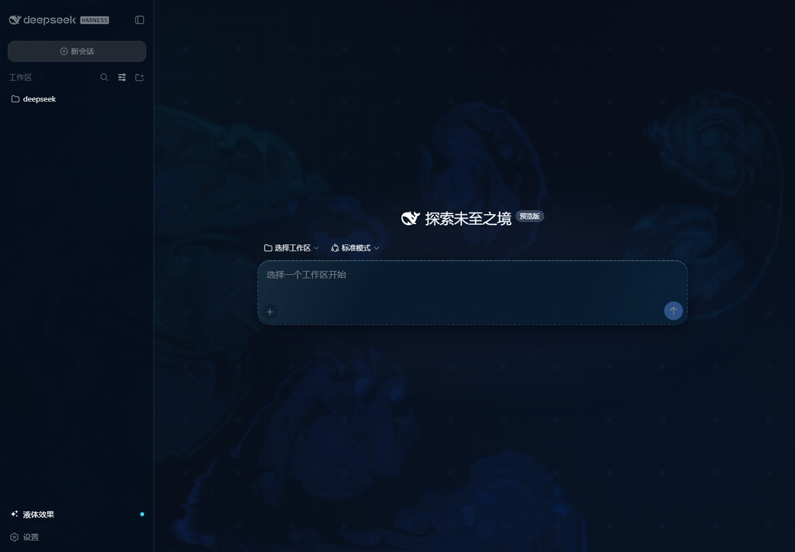

<div align="center">

# Deep Ocean Liquid Glass Wallpaper

克制的 Deep Ocean WebGL 流体、可复用 Liquid Glass 材质，以及完整的 DeepSeek Harness UI 集成。

[English](./README.md) | **简体中文**

</div>



上图展示完整 Harness 集成：Fluid Canvas 位于应用后方，Sidebar、Composer、Selector、Menu、Modal、Tool、Code 和 Terminal 使用统一而克制的 Deep Ocean Glass 体系。

## 项目包含什么

- 可直接用于浏览器和 Windows Lively Wallpaper 的 WebGL/WebGL2 流体壁纸。
- 固定的近黑 Navy → Deep Blue → Cyan/Aqua 配色，不生成随机彩虹色。
- 缓慢 Ambient Flow、鼠标交互、DPR 限制、后台暂停和 Reduced Motion 支持。
- 可复用的 `glass-soft`、`glass`、`glass-strong` 和 `glass-pill` CSS 材质。
- 带内置控制面板和 Host 持久化的完整 DeepSeek Harness 版本化补丁。
- 面向只需要背景生命周期的开发者提供轻量 Cordis Adapter。
- WebGL 或 `backdrop-filter` 不可用时，保留静态 Deep Ocean 和更不透明的 Glass 降级样式。

## 安装到 DeepSeek Harness

如果你需要效果图中的完整 UI，推荐使用这种方式。安装器只修改 [`harness/changed-files.txt`](harness/changed-files.txt) 列出的 63 个 Liquid Glass 集成文件，不会重新分发整个 Harness 仓库。

当前完整验证的 Harness Revision：

```text
47f943859bef60e4160492346772ded9b24f765a
```

### Windows

```powershell
git clone https://github.com/Jeromechen13/deep-ocean-liquid-glass-wallpaper.git
git clone https://github.com/deepseek-ai/deepseek-harness.git

git -C .\deepseek-harness checkout 47f943859bef60e4160492346772ded9b24f765a

powershell -ExecutionPolicy Bypass `
  -File .\deep-ocean-liquid-glass-wallpaper\harness\install.ps1 `
  -HarnessPath .\deepseek-harness

cd .\deepseek-harness
pnpm dsh web
```

### macOS 和 Linux

```sh
git clone https://github.com/Jeromechen13/deep-ocean-liquid-glass-wallpaper.git
git clone https://github.com/deepseek-ai/deepseek-harness.git

git -C ./deepseek-harness checkout 47f943859bef60e4160492346772ded9b24f765a
sh ./deep-ocean-liquid-glass-wallpaper/harness/install.sh ./deepseek-harness

cd ./deepseek-harness
pnpm dsh web
```

安装器会先验证补丁 SHA-256 并执行 `git apply --check`，默认拒绝有本地改动的工作区和不受支持的 Harness 版本，随后安装依赖并运行完整构建。版本兼容参数和卸载步骤见[完整 Harness 指南](harness/README.md)。

### Harness 内置控制

快捷面板位于 Sidebar 底部；完整面板位于 **设置 → 通用 → Deep Ocean 液体背景**。

| 参数 | 默认值 | 范围或选项 |
| --- | ---: | --- |
| 开启状态 | 开启 | 开启/关闭 |
| 透明度 | 48 | 0–100 |
| 亮度 | 78 | 35–120 |
| 流动速度 | 60 | 0–100 |
| 鼠标扰动力度 | 55 | 0–100 |
| Bloom | 30 | 0–100 |
| 配色 | Ocean | Abyss / Ocean / Cyan |
| 质量 | Balanced | Eco / Balanced / High |

所有改动会立即预览，并通过 Harness 的 `ui-liquid-glass` Settings Namespace 持久化。

## 预览独立壁纸

不需要构建或安装依赖：

```text
git clone https://github.com/Jeromechen13/deep-ocean-liquid-glass-wallpaper.git
cd deep-ocean-liquid-glass-wallpaper
python -m http.server 8000
```

打开 `http://localhost:8000/`。Demo 可以调整透明度、亮度、流动速度、鼠标扰动力度、Bloom、配色和质量，也支持暂停、恢复和重置。

## 用作 Lively Wallpaper

1. Clone 仓库或下载 ZIP。
2. 保留完整的仓库目录结构。
3. 在 [Lively Wallpaper](https://github.com/rocksdanister/lively) 中添加仓库目录或根目录的 `index.html`。
4. 如果鼠标扰动没有响应，在壁纸宿主中开启 Mouse Input。

根页面会加载 `demo/`，Demo 会继续使用 `src/` 下的共享资源。

## 嵌入其他网页

加载 Glass 样式、创建插件拥有的 Canvas，然后加载 Fluid Engine：

```html
<link rel="stylesheet" href="./src/liquid-glass.css">

<canvas id="dsh-liquid-background" aria-hidden="true"></canvas>

<script src="./src/fluid-wallpaper.js"></script>
```

让应用内容保持在 Canvas 上方：

```css
#dsh-liquid-background {
  position: fixed;
  inset: 0;
  z-index: 0;
  pointer-events: none;
}

.app {
  position: relative;
  z-index: 1;
}
```

Engine 初始化后会派发 `dsh-liquid-fluid-ready`，并暴露 `window.__DSH_LIQUID_FLUID__`：

```js
window.__DSH_LIQUID_FLUID__.updateConfig({
  flowSpeed: 0.4,
  pointerForce: 0.35,
  bloom: 0.2,
  palette: 'ocean',
  quality: 'balanced',
});

window.__DSH_LIQUID_FLUID__.setEnabled(false); // 暂停
window.__DSH_LIQUID_FLUID__.setEnabled(true);  // 恢复
window.__DSH_LIQUID_FLUID_CLEANUP__?.();       // 销毁
```

透明度和最终亮度由 Canvas 合成样式控制：

```js
const canvas = document.getElementById('dsh-liquid-background');
canvas.style.opacity = '0.48';
canvas.style.filter = 'brightness(0.78) saturate(1.08)';
```

可以使用 `dsh-glass-soft`、`dsh-glass`、`dsh-glass-strong` 或 `dsh-glass-pill` 应用可复用 Glass Material。

## 项目结构

```text
assets/                              效果预览图
demo/                                独立控制面板和预览
src/fluid-wallpaper.js               WebGL Engine 和生命周期 Runtime
src/liquid-glass.css                 Glass Tokens、Surface 和 Layering
harness/                              完整版本化 Harness 安装器
integrations/deepseek-harness/        轻量 Cordis Adapter
index.html                            浏览器和 Lively 入口
LICENSE                              MIT License Notices
THIRD_PARTY_NOTICES.md                上游项目署名
```

## 性能和降级行为

- 一个插件拥有的 Canvas 和一个 WebGL Context。
- DPR 上限为 `1.5`。
- Eco `96/512`、Balanced `128/1024`、High `192/1024` 三档 Simulation/Dye 质量。
- 页面隐藏或效果关闭时暂停动画。
- `prefers-reduced-motion` 开启时降低 Ambient 和 Pointer 计算量。
- 切换质量时只重建 Framebuffer，不新增 WebGL Context。
- WebGL 失败时保留静态 Deep Ocean Gradient，Host UI 仍然可用。
- 不支持 Backdrop Filter 时改用更不透明的 Glass Surface。

Strong GPU Refraction 当前未启用。重点组件使用 CSS Liquid Glass 的边缘高光、内部反射、Tint、Blur 和浮动阴影，避免创建组件级 WebGL Context 或破坏 Hit Testing。

## License 与致谢

Fluid Solver 基于 Pavel Dobryakov 的 [WebGL-Fluid-Simulation](https://github.com/PavelDoGreat/WebGL-Fluid-Simulation)，使用 MIT License。完整补丁会修改 [DeepSeek Harness](https://github.com/deepseek-ai/deepseek-harness) 中选定的文件，该项目同样使用 MIT License。

原始 Notice 已保留在 [`LICENSE`](LICENSE)、Engine Source 和 [`THIRD_PARTY_NOTICES.md`](THIRD_PARTY_NOTICES.md) 中。
